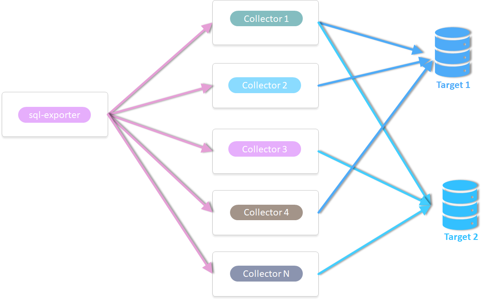
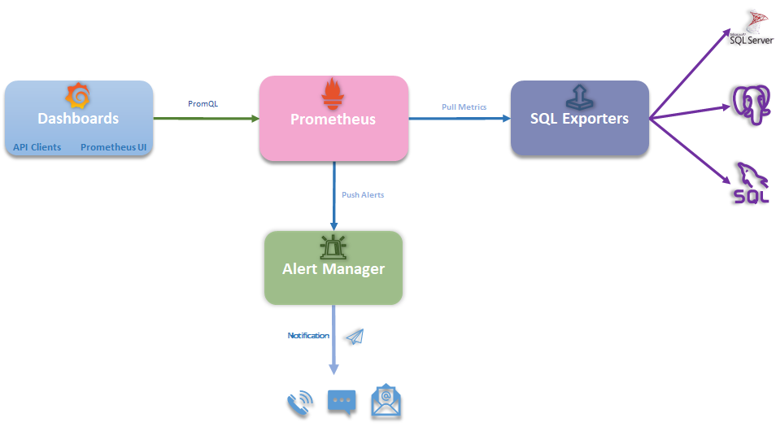
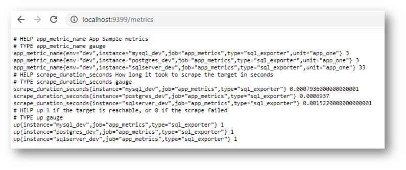
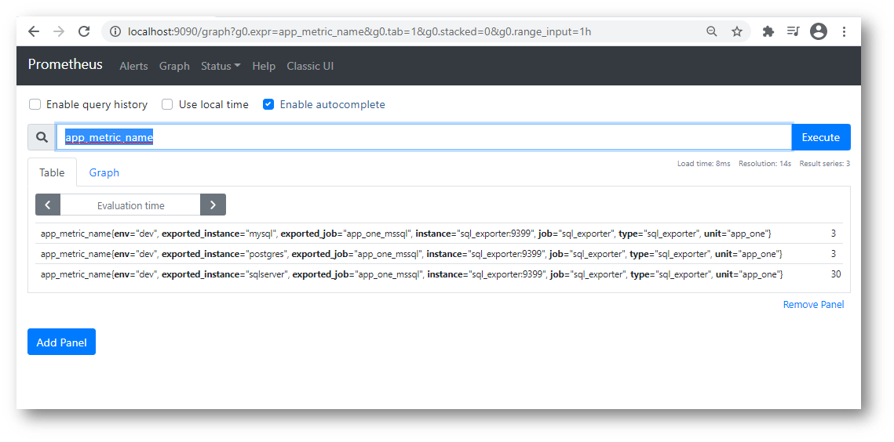
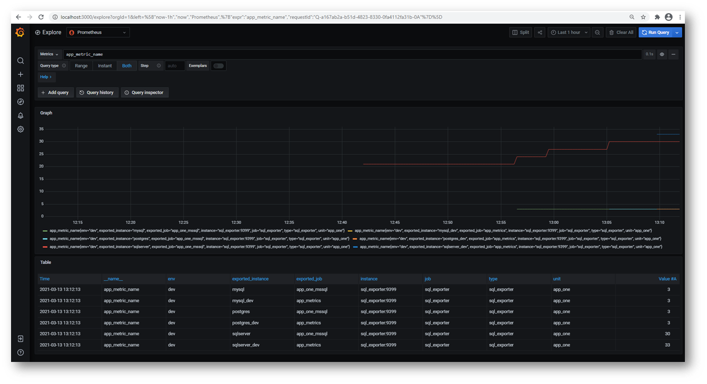

# Prometheus SQL Exporter



### Deployment Strategy



Execute `docker-compose up`

````bash
E:\githubRepos\prometheus-sql-exporter-usage>docker-compose up
Starting prometheus-sql-exporter-usage_postgres_1        ... done
Starting prometheus-sql-exporter-usage_mssql_1           ... done
Starting prometheus-sql-exporter-usage_mysql_1           ... done
Starting prometheus-sql-exporter-usage_prometheus_1      ... done
Starting prometheus-sql-exporter-usage_volume_exporter_1 ... done
Starting prometheus-sql-exporter-usage_sql_exporter_1    ... done
Starting prometheus-sql-exporter-usage_grafana_1         ... done
````

### Metrics endpoint



### Prometheus



### Grafana




# Connecting To DBs

All Connections


## MSSQL


## Postgresql


## MySQL


